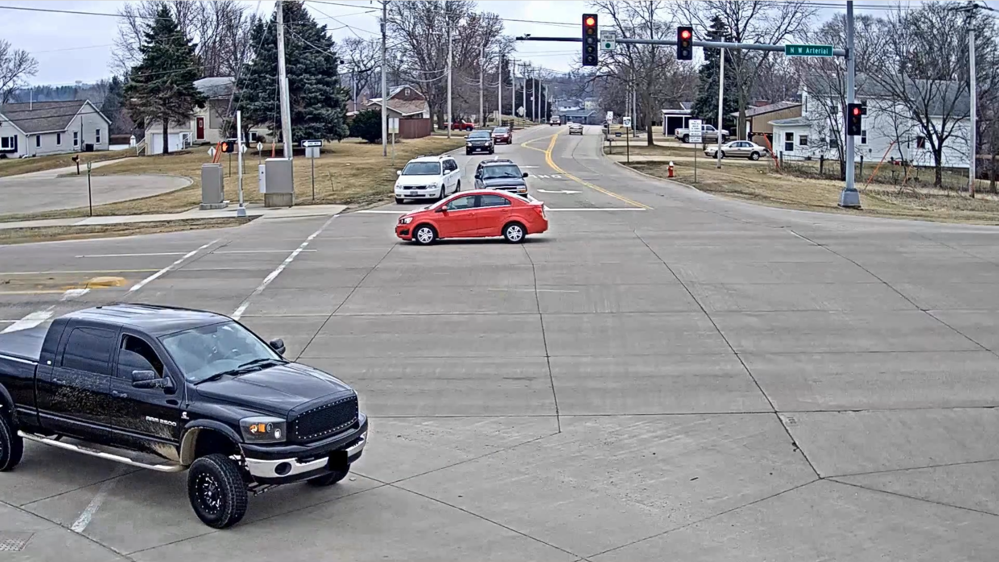
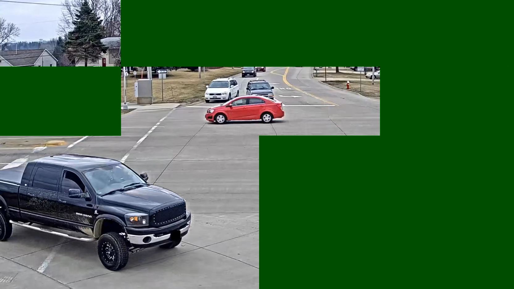

# TileClipper
## Introduction
This repository contains codes/artifacts for the paper ["TileClipper: Lightweight Selection of Regions of Interest from Videos for Traffic Surveillance"](https://www.usenix.org/conference/atc24/presentation/chaudhary), published at USENIX Annual Technical Conference (ATC) 2024. TileClipper is a system that utilizes tile sampling to substantially reduce bandwidth consumption by selecting spatial regions (tiles) of interest for further analysis at the server. This repository has been evaluated by the Artifact Evaluation Committee of ATC and certified as reproducible. Please write to shubhamch@iiitd.ac.in for any queries/doubts.
 | 
:--:| :--:
**Before Tile Pruning**| **After Tile Pruning**

## Getting Started

### 1) Directory Structure
```
└── assets 
|   ├── Bitrates                    : Bitrates of all videos
|   ├── F2s                         : Calibrated outputs
|   ├── GroundTruths                : Yolov5x Groundtruths
|   ├── GroundTruths_TileLevel      : StrongSORT-Yolo groundtruths for calibration
|   ├── Runtimes                    : Speed (fps) pickle files 
|   |   ├── On Nano
|   |   ├── On RPi4
|   |
|   ├── labels                      : Labels to calculate accuracy
|   ├── rates.pkl                   
|   ├── ratios.pkl                   
|   ├── UnremovedTileFrameSnip.png               
|   ├── tileRemovedFrameSnip1.png                  
|
└── baselines
|   ├── CloudSeg                    : CloudSeg codes
|   ├── DDS                         : DDS artifacts
|   ├── Reducto                     : Reducto implementation
|   ├── StaticTileRemoval           : STR codes
|   ├── README.md                   
|              
└── src        
|   ├── GT                          : StrongSORT-Yolo codebase
|   ├── scripts                     : Scripts to run TileClipper
|   ├── calibrate.py                : For TileClipper calibration
|   ├── capture.sh                  : Live tiled video encoding from camera 
|   ├── detect_for_groundtruth.py   : Generate labels/GT using  Yolov5x
|   ├── get_results.ipynb           : Generates all plots.
|   ├── live_client.py              : Camera-side code during live experiment
|   ├── live_server.py              : Server-side code during live experiment
|   ├── metric_calculator.py        : Base code for performance metric calculation
|   ├── tileClipper.py              : TileClipper's source code.
|   ├── ratios_withVideoName.pkl
|   ├── requirements.txt
|
└── utils                           : Has addon scripts and codes.  
|
└── videos                          : Available after downloading and extracting the dataset

```

### 2) Dependencies
All the experiments are designed and tested on Ubuntu 20.04 LTS. Use the same OS to reproduce results. For a different Linux distribution, change the commands accordingly. The codebase uses FFmepg (v4.2.7), GPAC (v2.2.1), and Kvazaar (v2.0.0) for encoding/manipulating the tiled videos. Install FFmpeg using `sudo apt install ffmpeg`. [Kvazaar](https://github.com/ultravideo/kvazaar) and [GPAC](https://github.com/gpac/gpac/wiki/GPAC-Build-Guide-for-Linux) requires building. Follow the build instructions in their respective repositories. For GPAC, go with a full GPAC build, not the minimal one. Unless otherwise stated, we use Python 3.8 for all the experiments.

### 3) Creating Python Environment
```bash
$> git clone https://github.com/shubhamchdhary/TileClipper.git
$> cd TileClipper
$> git submodule update --init --recursive
$> pip3 install virtualenv                  
$> python3 -m virtualenv env
$> source env/bin/activate                       # for bash
(env) $> pip3 install -r src/requirements.txt    # installs python libraries
```

### 4) Downloading Dataset
Note that only the video bitrates are available as intermediate results. You can generate you own tiled videos using the codes discussed in Section "Tile Encoding".

### 5) Running TileClipper on a sample video
TileClipper operates on tiled videos. The `videos/` folder contains a `TestDataset/` folder with a sample video to validate TileClipper. Run TileClipper on it as:

```bash
(env) $> python3 src/tileClipper.py --tiled-video-dir videos/TestDataset/tiled_4x4_mp4/AITr1cam10 --percentile-array-filename assets/F2s/f2s_AITr1cam10_cluster10.pkl  --cluster-indices-file assets/F2s/AITr1cam10_cluster_indices.pkl --gamma 1.75
```
Once run, you'll find a `removedTileMp4/` folder inside `videos/TestDataset/` directory. It contains the segmented tiled video with pruned tiles. You can play these using GPAC as `gpac -play video.mp4`. Other video players like VLC cannot decode tiled videos.

Note that the above execution assumes that the calibration is already done to get the percentile and cluster files. To run calibration on a video, use `calibrate.py` as:
```bash
(env) $> python3 src/calibrate.py --tiled-video-dir videos/dataset/tiled_4x4_mp4/video_name --assets-folder assets/
```
It'll create an `F2s/` folder inside `assets/` with the pickle files with the video name. It assumes the tile-level ground truths are there in the `assets/GroundTruths_TileLevel/` folder. These ground truths can be generated using the files in `src/GT/`. The steps are in a separate [README](src/GT/README.md).

### 6) Reproducing results
To quickly reproduce the results, the necessary groundtruths, labels, and processed files are already placed inside the `videos/` and `baselines/` folders.
Utilize the `src/get_results.ipynb` notebook file to generate the plots. Note this notebook file must be run locally, not on Google Colab, as it parses the dataset to generate results. The `get_results.ipynb` file can be run inside VS Code IDE or Jupyter Notebook.

## Running Experiments
Caveat: Running the experiments below overwrites the files inside `videos/`. 

### 1) Tile Encoding
TileClipper operates on tiled videos. Kvazaar and GPAC are two open-source tools available for research purposes to encode videos with tiles. We provide `utils/script.py` to automate the encoding process.

Use `script.py` to encode a video as:

```bash
(env) $> python3 script.py --path-to-mp4 dataset/ --tiles 4x4 --res 1280x720
```
This will generate segmented tiled videos inside `tile_4x4_mp4/` folder within the dataset folder. Encoding is a time-consuming process that requires a large amount of space because it extracts raw videos. We've provided the tile-encoded videos in `videos/` to save time.

### 2) Generating Tile-level Groundtruths
For calibration, we require groundtruths (GT), which specifies the tiles with relevant objects. We use StrongSORT-Yolo to generate these GTs. The instructions are in this [README](src/GT/README.md).

### 3) Running TileClipper
#### a) Calibration 
To get calibrated outputs to run TileClipper on all videos, use:
```bash
(env) $> python3 runCalibrateOnAllVideos.py
```
This will generate the percentile and cluster files inside `assets/F2s` folder.

#### b) Tile Filtering
Run the script below to start tile filtering.
```bash
(env) $> python3 runTileClipperOnAllVideos.py
```
The output video with pruned tiles is generated inside `removedTileMp4/` folder inside each dataset directory.

### 4) Generating Labels 
#### a) Tile Aggregation
Since Yolov5 cannot decode tiled videos, all the videos should be pre-processed to get normal videos by merging their tiles (called tile aggregation). We've provided the required code in `utils/utils.py`.

To aggregate tiles of all videos of TileClipper, use:
```bash
(env) $> cd utils
(env) $> python3 aggrTiles.py
```
This will create an `aggrMp4/` folder in the current directory containing all the videos. We've already generated this directory and kept inside `videos/`.

#### b) Running Yolov5
We've modified the Yolov5s code (`src/detect_for_groundtruth.py`) to generate labels and groundtruths for large-scale evaluations. To run it on a video, use:
```bash
(env) $> python3 detect_for_groundtruth.py --source videos/dataset/segmentedVideoFolder --save-txt --save-labelfile-name labelFileName.txt --classes 0 1 2 3 4 5 6 7
```
This will create a folder `labels` with `labelFileName.txt` in the current directory.

Generating labels for all videos.
```bash
(env) $> cd src/scripts
(env) $> python3 generateLabelsForAll.py    # outputs inside ./labels/
```

### 5) Running Baselines
Follow this [README](baselines/README.md).

## Citing TileClipper

```bibtex
@inproceedings {tileClipper,
author = {Shubham Chaudhary and Aryan Taneja and Anjali Singh and Purbasha Roy and Sohum Sikdar and Mukulika Maity and Arani Bhattacharya},
title={$\{$TileClipper$\}$: Lightweight Selection of Regions of Interest from Videos for Traffic Surveillance},
booktitle = {2024 USENIX Annual Technical Conference (USENIX ATC 24)},
year = {2024},
isbn = {978-1-939133-41-0},
address = {Santa Clara, CA},
pages = {967--984},
url = {https://www.usenix.org/conference/atc24/presentation/chaudhary},
publisher = {USENIX Association},
month = jul
}
```
